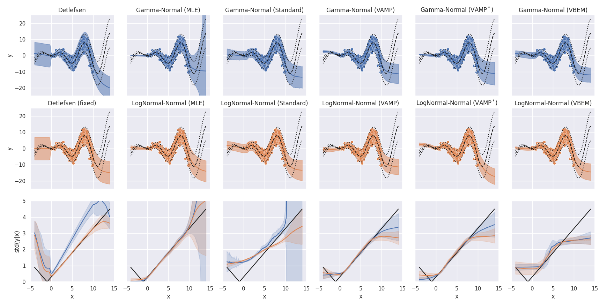
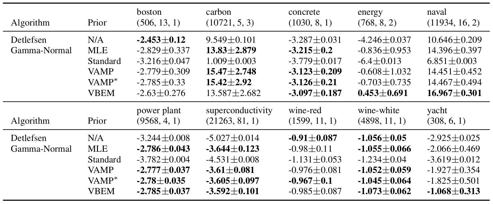
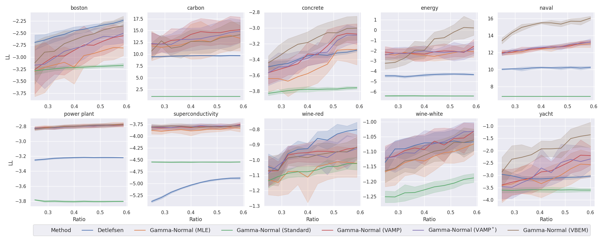
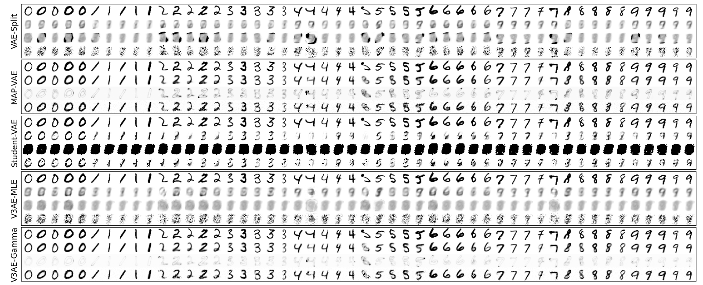
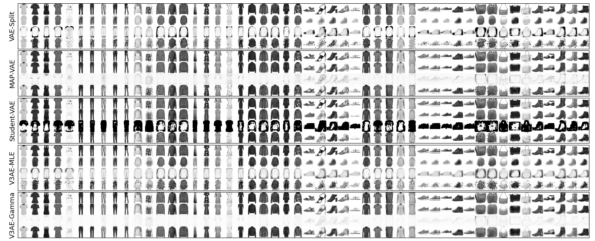
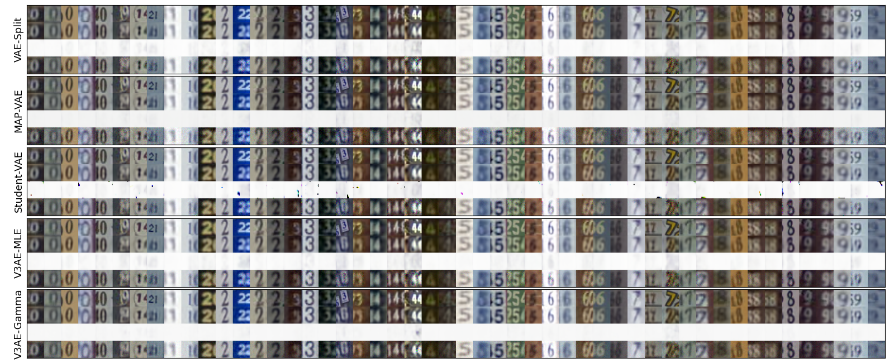

# Variational Variance

This repository is the official implementation of 
[Variational Variance: Simple and Reliable Variance Parameterization](https://arxiv.org/abs/2006.04910). 

We include some [code](https://github.com/SkafteNicki/john) files from
[Reliable training and estimation of variance networks](https://arxiv.org/abs/1906.03260)
in the `john-master` sub-directory of our repository. Their methods constitute one of our baselines.
Any file therein denoted with `_orig` is their original code. We had to modify certain files for integration.
We include these originals for easy differencing. Any file without an `_orig` pair is unmodified.

## Requirements

To install requirements:
```setup
pip install -r requirements.txt
```

Our code is based in TensorFlow 2.1, which automatically detects and utilizes any available CUDA acceleration.
However, the baseline code from Detlefsen et al., 2019 (`john-master` sub-directory) is based in pyTorch.
Their code supports enabling and disabling CUDA.
Any of our code that calls theirs does NOT access their CUDA option and consequently defaults with CUDA enabled.
Please be aware of this if running on a machine without access to CUDA acceleration.

To download UCI data sets (performed in `run_experiments.sh` as well):
```setup
python regression_data.py
```

Data for our VAE experiments downloads automatically via [TensorFlow Datasets](https://www.tensorflow.org/datasets).

## Training

Please see `run_experiments.sh`, which runs all of our experiments in sequence. However, we do not recommended doing so
due to the required time. Instead, please cherry pick the individual experimental calls and spread them across multiple
machines. If you downloaded a copy of this repository with a populated `results` sub-directory, then you may already
have all of our original results in which case you can skip this step and proceed to evaluation.

To reproduce images similar to those in the "Things that Failed" section of our appendix please run `run_appendix.sh`.

## Evaluation

Please see `run_analysis.sh`, which runs all of our experiments in sequence. This script will create an `assets` folder
if one does not already exist and populate it with the tables (as .tex files) and images (as .pdf files) that appear in
our manuscript. As it runs, it will hold open plots for interactive viewing. The script will NOT continue to the next
experiment until any plots for the current analysis are closed. Be aware that one must have either run 
`run_experiments.sh` or have a populated `results` sub-directory.

## Results

### Toy Data

Toy regression results. The top two rows contain individual experimental results for the
configuration in the title. Here, dashed and dotted black lines denote the true mean ± two standard
deviations. The colored dots are training points. The colored lines and their areas denote the predicted
mean ± two standard deviations. In the third row, we plot the true standard deviation (black) against
the predicted standard deviations (and its standard deviation) across 20 trials for the two experimental
configurations appearing above. The color identifies the method above by matching the colors.

### UCI Data

UCI regression log likelihoods reported as mean±std. We bold the top performer as well as
any others who are statistically indistinguishable (p ≥ 0.05). Tuples below experiment names are of
the form (# of observations , dim(x), dim(y))

### Active Learning

Log likelihoods across active learning steps for UCI data sets. The x axis is the ratio of
utilized training data to the available. Darker lines are means. Areas cover ± 1 standard deviation.

### Deep Latent Variable Models (VAEs)

VAE posterior predictive checks for MNIST. The rows within a subplot from top to bottom are randomly selected
test data followed by the posterior predictive mean and variance and a sample from it. The top subplot
optimizes separate mean and variance networks simultaneously. The next two employ methods from
Takahashi et al. (2018). The fourth is our control. Our method (bottom) has the best sample quality.


VAE posterior predictive checks for Fashion MNIST. Same arrangement as above.


VAE posterior predictive checks for SVHN. Same arrangement as above.

## Contributing

We have selected an MIT license for this repository.
